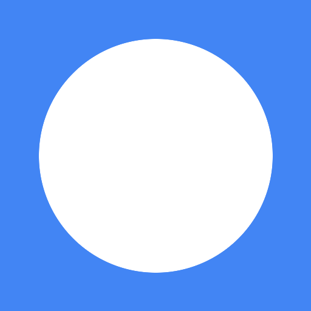

<p align="center">
  
</p>

<h1 align="center">RayTask</h1>

<p align="center">
  <strong>Google Tasks, right inside Raycast</strong>
</p>

<p align="center">
  <a href="#features">Features</a> ·
  <a href="#installation">Installation</a> ·
  <a href="#setup">Setup</a> ·
  <a href="#commands">Commands</a> ·
  <a href="#keyboard-shortcuts">Shortcuts</a>
</p>

---

## Features

- **Browse & Search** – View all your Google Tasks lists, filter by All / Today / Upcoming / Completed, and search across titles and notes.
- **Create Tasks** – Add tasks with title, notes, due date, and even nest them under a parent task.
- **Quick Add** – Instantly add a task from Raycast's root search using arguments (`Quick Add Task <title> [due date]`). Supports natural language like `tomorrow`, `next Friday`, or `2026-05-15`.
- **Edit & Organize** – Modify task details, move tasks between lists, complete/uncomplete, or delete.
- **Subtasks** – Visual hierarchy in lists. Add subtasks directly from the action panel.
- **Menu Bar** – Keep today's tasks visible in your macOS menu bar, updated every 10 minutes.
- **Open in Google Tasks** – Jump straight to the web view for any task when you need more.

---

## Installation

1. Clone or download this repository.
2. Run `npm install` to install dependencies.
3. Run `npm run dev` to start developing in Raycast.

> **Prerequisites:** Raycast for macOS and a Google Cloud project with the Google Tasks API enabled.

---

## Setup

Before using RayTask, you need a **Google OAuth Client ID**:

1. Open the [Google Cloud Console](https://console.cloud.google.com/apis/credentials) and select your project.
2. Make sure the **Google Tasks API** is enabled.
3. Configure the **OAuth consent screen** and add the scope:
   ```
   https://www.googleapis.com/auth/tasks
   ```
4. Create an **OAuth client ID**:
   - Application type: **iOS**
   - Bundle ID: `com.raycast`
   - (See the [Raycast guide](https://developers.raycast.com/utilities/oauth/getting-google-client-id) for details.)
5. Copy the **Client ID** and paste it into RayTask's extension preferences.

If the console asks for a redirect URI, use:
```
com.raycast:/oauth?package_name=raytask
```

---

## Commands

| Command | Mode | What it does |
|---------|------|--------------|
| **Google Tasks** | View | Browse your task lists and manage tasks inside them. |
| **Create Task** | View | Open a form to create a new task with list, title, notes, due date, and optional parent. |
| **Quick Add Task** | View | Add a task instantly via arguments. Supports natural language due dates (e.g., `tomorrow`, `EOD`, `next Friday`). |
| **Edit Task** | View | Pick any task from a list and edit its details. |
| **Today's Tasks** | Menu Bar | See today's tasks in your macOS menu bar. Refreshes every 10 minutes. |

---

## Keyboard Shortcuts

Inside the **Google Tasks** list view:

| Shortcut | Action |
|----------|--------|
| `↵` (Enter) | Complete / Re-open a task |
| `⌘ + ↵` | Show task details |
| `⌘ + E` | Edit task |
| `⇧ + ⌘ + N` | Add subtask |
| `⌃ + X` | Delete task |
| `⌘ + [` | Go back |

---

## Tech Stack

- [Raycast API](https://developers.raycast.com/) – Native macOS command palette integration
- [TypeScript](https://www.typescriptlang.org/) – Type-safe development
- [React](https://react.dev/) – UI components
- [Effect](https://effect.website/) – Structured, type-safe side effects for API calls
- [chrono-node](https://github.com/wanasit/chrono) – Natural language date parsing

---

## Scripts

| Script | Description |
|--------|-------------|
| `npm run dev` | Start development mode in Raycast |
| `npm run build` | Build the extension for distribution |
| `npm run lint` | Run Raycast linter |
| `npm run fix` | Auto-fix linting issues |

---

## License

MIT © [balazstasi](https://github.com/balazstasi)
